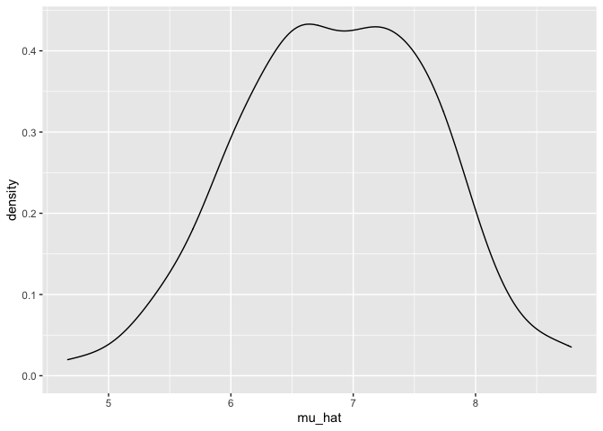
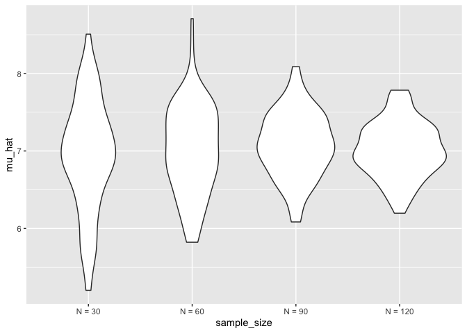
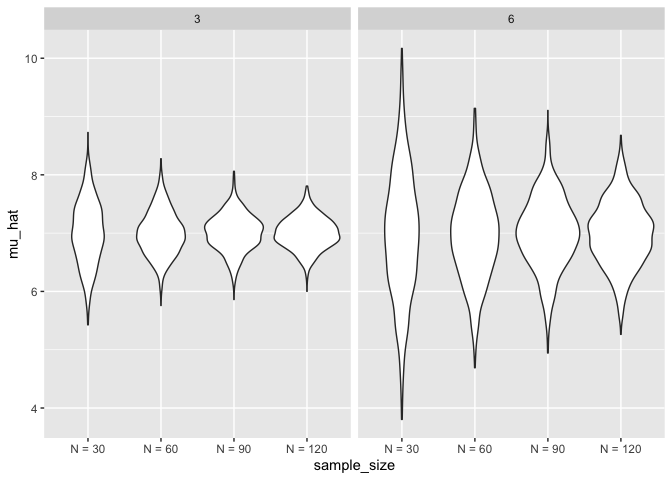

simulation
================
Amy Yeung
2022-11-03

wow you can type multiple rows of text at the same time with
shift+option!! wow you can type multiple rows of text at the same time
with shift+option!! wow you can type multiple rows of text at the same
time with shift+option!! wow you can type multiple rows of text at the
same time with shift+option!! wow you can type multiple rows of text at
the same time with shift+option!!

``` r
library(tidyverse)
```

    ## ── Attaching packages ─────────────────────────────────────── tidyverse 1.3.2 ──
    ## ✔ ggplot2 3.3.6      ✔ purrr   0.3.5 
    ## ✔ tibble  3.1.8      ✔ dplyr   1.0.10
    ## ✔ tidyr   1.2.0      ✔ stringr 1.4.1 
    ## ✔ readr   2.1.2      ✔ forcats 0.5.2 
    ## ── Conflicts ────────────────────────────────────────── tidyverse_conflicts() ──
    ## ✖ dplyr::filter() masks stats::filter()
    ## ✖ dplyr::lag()    masks stats::lag()

## Simulations!!

``` r
sim_mean_sd = function(n_obs, mu = 7, sigma = 4) {
   x = rnorm(n = n_obs, mean = mu, sd = sigma)

  tibble(
  mu_hat = mean(x),
  sigma_hat = sd(x)
  )
}
```

How did we use this before?

``` r
sim_mean_sd(n_obs = 30)
```

    ## # A tibble: 1 × 2
    ##   mu_hat sigma_hat
    ##    <dbl>     <dbl>
    ## 1   8.56      3.77

``` r
sim_mean_sd(n_obs = 30)
```

    ## # A tibble: 1 × 2
    ##   mu_hat sigma_hat
    ##    <dbl>     <dbl>
    ## 1   7.55      4.23

``` r
sim_mean_sd(n_obs = 30)
```

    ## # A tibble: 1 × 2
    ##   mu_hat sigma_hat
    ##    <dbl>     <dbl>
    ## 1   7.00      3.50

Each time returns a different result - How do we put them all together?

Let’s start with a for loop!

``` r
output = vector("list", length = 100) # do it 100 times

for (i in 1:100) {
  output[[i]] = sim_mean_sd(n_obs = 30)
}

bind_rows(output) 
```

    ## # A tibble: 100 × 2
    ##    mu_hat sigma_hat
    ##     <dbl>     <dbl>
    ##  1   7.82      3.47
    ##  2   6.94      3.85
    ##  3   6.62      4.97
    ##  4   5.96      3.87
    ##  5   7.66      3.28
    ##  6   6.31      4.91
    ##  7   6.98      4.04
    ##  8   6.19      5.11
    ##  9   7.17      3.66
    ## 10   6.42      3.92
    ## # … with 90 more rows

Let’s use list columns instead

`expand_grid` to give all possible combinations of inputs

``` r
sim_results_df =
expand_grid(
  sample_size = 30,
  iteration = 1:100
) %>% 
  mutate(
    estimate_df = map(sample_size, sim_mean_sd)
  ) %>% 
  unnest(estimate_df)
```

``` r
sim_results_df %>% 
  ggplot(aes(x = mu_hat)) +
  geom_density()
```

<!-- -->

!!!!!!!!!!!!!!!!!!!!!!!!!!!!!!!!!!!!!!!!!!!!!!!!!!!!!!!!!!!!
!!!!!!!!!!!!!!!!!!!!!!!!!!!!!!!!!!!!!!!!!!!!!!!!!!!!!!!!!!!!
!!!!!!!!!!!!!!!!!!!!!!!!!!!!!!!!!!!!!!!!!!!!!!!!!!!!!!!!!!!!
!!!!!!!!!!!!!!!!!!!!!!!!!!!!!!!!!!!!!!!!!!!!!!!!!!!!!!!!!!!!

## What about changing the sample size?

``` r
sim_results_df =
  expand_grid(
  sample_size = c(30, 60, 90, 120),
  iteration = 1:100
) %>% 
  mutate(
    estimate_df = map(sample_size, sim_mean_sd)
  ) %>% 
  unnest(estimate_df)
```

4 sample sizes, 100 replicates each time - can look at distribution of
sample means and sd.

``` r
sim_results_df %>% 
  mutate(
    sample_size = str_c("N = ", sample_size),
    sample_size = fct_inorder(sample_size)
  ) %>% 
  ggplot(aes(x = sample_size, y = mu_hat)) +
  geom_violin()
```

<!-- -->

``` r
sim_results_df %>% 
  mutate(
    sample_size = str_c("N = ", sample_size),
    sample_size = fct_inorder(sample_size)
  ) %>% 
  group_by(sample_size) %>% 
  summarise(
    emp_st_err = sd(mu_hat)
  )
```

    ## # A tibble: 4 × 2
    ##   sample_size emp_st_err
    ##   <fct>            <dbl>
    ## 1 N = 30           0.716
    ## 2 N = 60           0.572
    ## 3 N = 90           0.423
    ## 4 N = 120          0.359

Let’s see 2 inputs with `map2`

``` r
sim_results_df =
  expand_grid(
  sample_size = c(30, 60, 90, 120),
  true_sigma = c(6, 3),
  iteration = 1:1000
) %>% 
  mutate(
    estimate_df = map2(.x = sample_size, .y = true_sigma, ~sim_mean_sd(n_obs = .x, sigma = .y)) 
  ) %>% 
  unnest(estimate_df)
```

``` r
sim_results_df %>% 
  mutate(
    sample_size = str_c("N = ", sample_size),
    sample_size = fct_inorder(sample_size)
  ) %>% 
  ggplot(aes(x = sample_size, y = mu_hat)) +
  geom_violin() +
  facet_grid(.~ true_sigma)
```

<!-- -->

Knitting simulations takes some time; start with small sample sizes and
make sure things knit first, then increase sample size.
